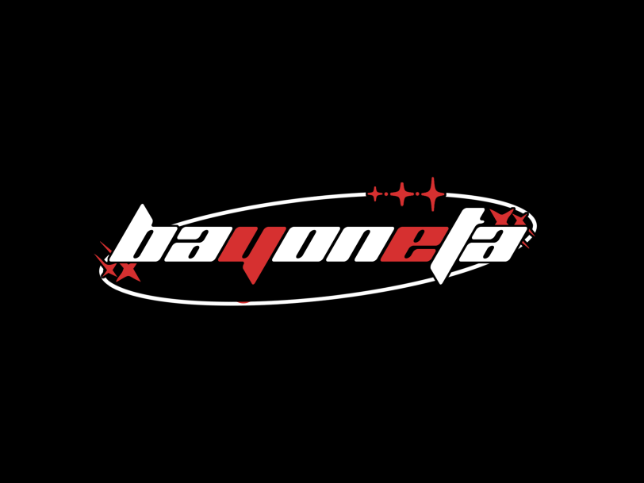

<h1 align="center">Bayoneta</h1>

  

<h2 align="center">Who we are?</h2>

We are the community, who creating high-quality Minecraft clients

<h2 align="center">Check out our website -></h2>

https://bayoneta.rip/

<h2 align="center">Check out our discord servers -></h2>

https://discord.gg/mPCwX4vsfr - Bayoneta's main server

https://discord.io/mcreflection - our developers' server for Mensury and Reflection clients

 
---

  

